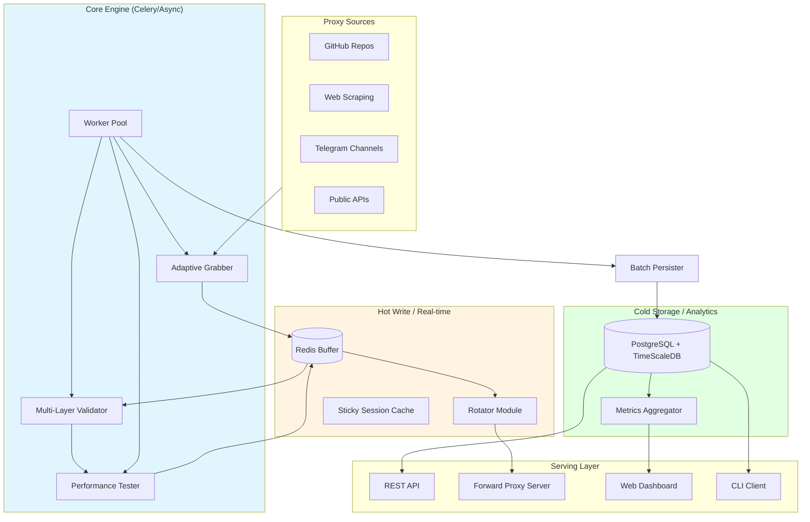

# 1proxy Platform - Advanced Architecture Plan

## Executive Summary

1proxy is a high-performance proxy aggregation platform designed to consolidate, validate, and serve free proxies with enterprise-grade reliability. This refined plan incorporates high-frequency database optimizations, multi-layered anonymity detection, and a resilient "Adaptive Grabber" system.

## Architecture Overview

## Strategic Improvements

### 1. Hybrid Storage Strategy

To handle thousands of proxy status updates per second without bottlenecking the database:

- **Redis (Hot)**: Stores ephemeral state, scores, and rotation pools. Uses Sorted Sets for O(log N) retrieval of top-scoring proxies.
- **PostgreSQL + TimeScaleDB (Cold)**: Stores metadata and historical metrics. Partitioned by time for efficient cleanup and analytical queries.
- **Batch Persistence**: A dedicated background process periodically flushes status snapshots from Redis to PostgreSQL to minimize I/O.

### 2. Multi-Layer Anonymity Detection

Goes beyond standard headers to ensure "Elite" status:

- **Layer 1**: Header analysis (Via, X-Forwarded-For, etc.).
- **Layer 2**: IP Reputation (AbuseIPDB, VirusTotal integration).
- **Layer 3**: Protocol Leak Detection (DNS/WebRTC leaks via headless browser checks).
- **Layer 4**: TLS Fingerprinting (JA3 signatures) to ensure the proxy mimics real browser behavior.

### 3. Adaptive Grabber Module

Solves the "brittle scraper" problem:

- **Tiered Strategy**: Uses hardcoded CSS/XPath selectors first.
- **Semantic Fallback**: If exact selectors fail, searches for semantic patterns (e.g., "text containing 'IP'").
- **LLM Healing**: Periodically uses LLMs to analyze broken pages and propose new selectors, which are then cached.

### 4. Advanced Rotation & Sessions

- **Forward Proxy Server**: Provides a single `host:port` entry point for users. Each request is automatically routed to the best available upstream proxy.
- **Sticky Sessions**: Token-based affinity. If a user provides a session ID, they keep the same proxy for a configurable TTL, provided it stays healthy.
- **Consistent Hashing**: Fallback mechanism to ensure balanced distribution without state when possible.

### 5. Cold Start & Bootstrapping

- **Aggressive Seeding**: Multi-threaded scraping of 20+ known public aggregators.
- **Verification Loop**: Rapid initial re-validation (every 2-5 mins) to filter out volatile free proxies quickly.
- **Contributor Credits**: Allow users to submit lists for API priority.

## Implementation Roadmap

### Phase 1: Storage & Infrastructure (Weeks 1-2)

- Hybrid Redis/Postgres setup.
- TimeScaleDB partitioning for history.
- Core Pydantic models with validation.

### Phase 2: The Validation Pipeline (Weeks 3-4)

- Async validation engine (aiohttp).
- Multi-layer leak detection.
- Adaptive re-validation logic (Scylla pattern).

### Phase 3: Adaptive Grabbing (Weeks 5-6)

- Base Grabber with registry pattern.
- Semantic selector fallback.
- GitHub/Telegram/Web fetchers.

### Phase 4: Serving & Rotation (Weeks 7-8)

- Forward Proxy interface (Python/Go).
- Sticky session logic in Redis.
- FastAPI REST endpoints.

### Phase 5: UI & CLI (Weeks 9-10)

- Next.js 14 real-time dashboard.
- Typer-based CLI with table/JSON output.
- Global metrics & source health tracking.

## Technology Stack (Refined)

- **Backend**: FastAPI (Python 3.12+), Celery, Redis.
- **Persistence**: PostgreSQL + TimeScaleDB (for metrics).
- **Frontend**: Next.js 14, Tailwind CSS, shadcn/ui.
- **Scraping**: Playwright (for JS-heavy sources), aiohttp (for high-speed fetch).
- **ML/LLM**: Local Ollama/Llama-cpp for selector healing.