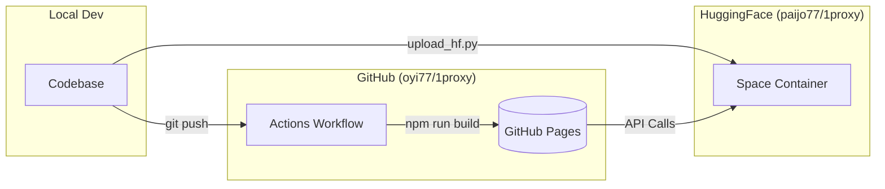

# 🚀 Deployment Guide - GitHub Pages + HuggingFace

This document explains how to deploy 1proxy with:
- **Frontend**: GitHub Pages (free static hosting)
- **Backend**: HuggingFace Spaces (free API hosting)

## 🏗️ Deployment Architecture



## ✅ Current Production Status

### Backend (HuggingFace Space)
- **URL**: [https://paijo77-1proxy.hf.space](https://paijo77-1proxy.hf.space)
- **API Docs**: [https://paijo77-1proxy.hf.space/docs](https://paijo77-1proxy.hf.space/docs)
- **Status**: ✅ Deployed and running

### Frontend (GitHub Pages) 
- **URL**: [https://oyi77.is-a.dev/1proxy/](https://oyi77.is-a.dev/1proxy/)
- **Status**: ✅ Deployed and running

---

## 📋 Initial Setup (Reference)

### 1. Enable GitHub Pages

1. Go to repository settings: `https://github.com/oyi77/1proxy/settings/pages`
2. Under "Build and deployment":
   - Source: **GitHub Actions**
3. Click **Save**

---

## 🔧 Configuration

### Frontend Environment Variables
The frontend is auto-configured in `.github/workflows/deploy-frontend.yml`:
```yaml
env:
  NEXT_PUBLIC_BASE_PATH: '/1proxy'
  NEXT_PUBLIC_API_URL: 'https://paijo77-1proxy.hf.space'
```

### Backend CORS
The backend accepts requests from:
- ✅ `https://oyi77.github.io`
- ✅ `https://oyi77.is-a.dev`
- ✅ `https://*.hf.space`

---

## 🚀 Ongoing Maintenance

### Update Frontend
Simply push changes to the `main` branch. GitHub Actions will handle the build and deployment automatically.

### Update Backend
1. Modify code in `1proxy-backend/`
2. Run the upload script:
   ```bash
   python upload_hf.py
   ```

---

## 🔐 OAuth Setup

To enable user authentication, set these secrets in your **HuggingFace Space Settings**:

| Secret | Callback URL |
|--------|--------------|
| `GITHUB_CLIENT_ID` | `https://paijo77-1proxy.hf.space/auth/github/callback` |
| `GOOGLE_CLIENT_ID` | `https://paijo77-1proxy.hf.space/auth/google/callback` |

---

**Built with ❤️ for the community**
