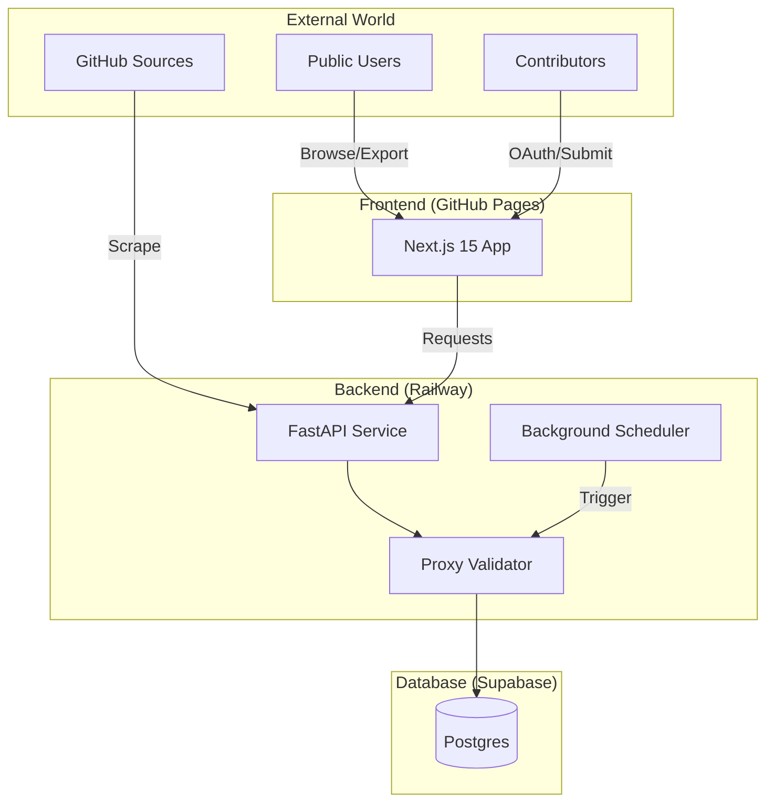
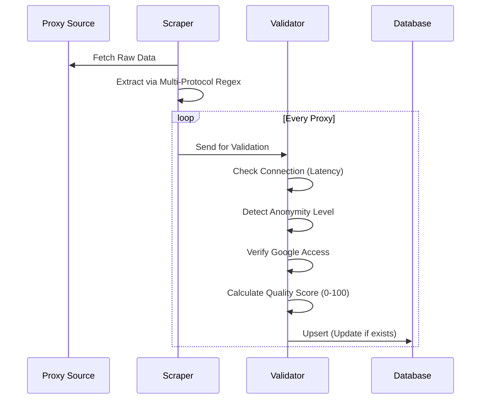
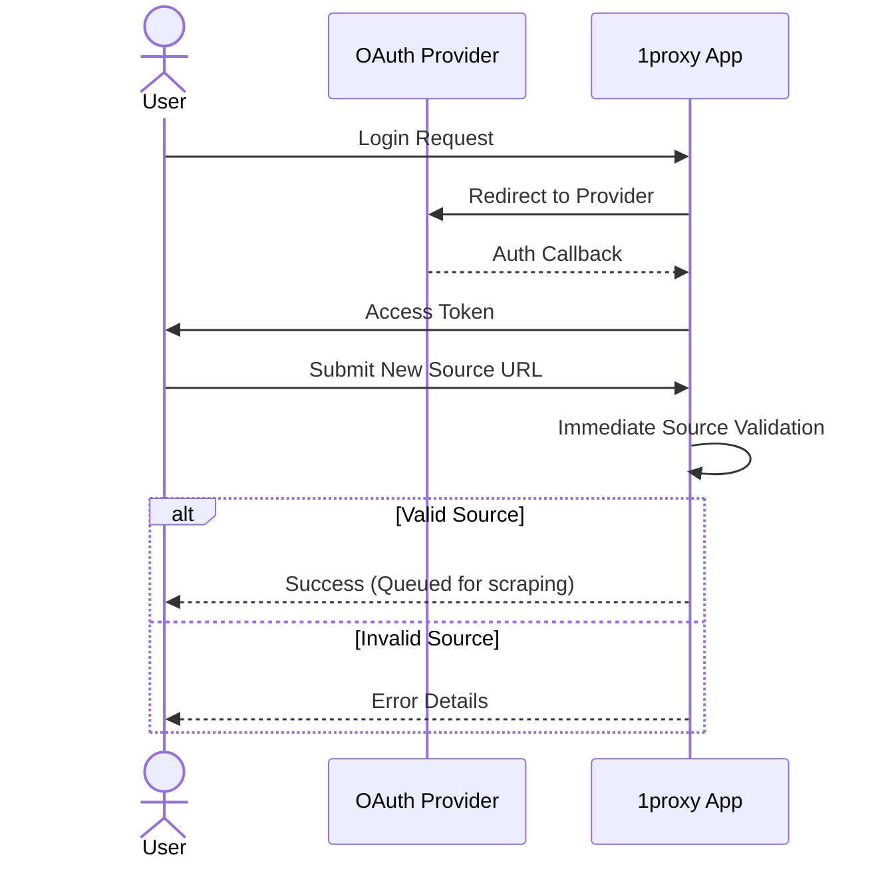

# 1proxy: Community-Driven Proxy Aggregation Platform


A high-performance, multi-user proxy aggregation platform where anyone can contribute proxy sources while maintaining public access to all proxies. Built with modern async Python, Next.js 15, and enterprise-grade validation.

## 📊 System Architecture



## ✨ Key Features

### For Everyone (Public Access)
- 🌐 **10+ Auto-Updated Sources** - GitHub repos refreshing daily/hourly.
- 🔍 **Advanced Filtering** - By protocol, country, anonymity, quality, speed.
- 📊 **Quality Scoring** - 0-100 score based on latency, anonymity, Google access.
- 💾 **Export Formats** - TXT, JSON, CSV.

### For Contributors (OAuth Required)
- 🔐 **GitHub/Google Login** - Secure authentication via standard providers.
- ➕ **Add Your Sources** - Share proxy lists with the community.
- ✅ **Real-time Validation** - Instant feedback on submitted source quality.

## 🚀 Quick Links

- **Frontend**: [https://oyi77.is-a.dev/1proxy/](https://oyi77.is-a.dev/1proxy/)
- **Backend API**: [https://helpful-alignment-production-2ae5.up.railway.app](https://helpful-alignment-production-2ae5.up.railway.app)
- **API Documentation**: [https://helpful-alignment-production-2ae5.up.railway.app/docs](https://helpful-alignment-production-2ae5.up.railway.app/docs)

---

## 🛠️ Technology Stack

| Component | Technology |
|-----------|------------|
| **Frontend** | Next.js 15, TypeScript, Tailwind CSS |
| **Backend** | FastAPI, SQLAlchemy (Async), Pydantic v2 |
| **Validation** | aiohttp, BeautifulSoup4, Custom Scoring |
| **Database** | SQLite (Dev) / Supabase PostgreSQL (Prod), Alembic |
| **Deployment** | GitHub Pages (FE), Railway (BE), Supabase (DB) |

---

## 🎯 Operational Flows

### 1. Proxy Validation Pipeline


### 2. User Contribution Flow


---

## 📖 Documentation & Maintenance

- **[docs/DEPLOYMENT_GUIDE.md](./docs/DEPLOYMENT_GUIDE.md)** - Short deployment runbook for GitHub Pages, Railway, and Supabase.
- **[docs/deployment.md](./docs/deployment.md)** - Detailed environment, OAuth, and secret-rotation guidance.
- **[LLM_CONTEXT.md](./docs/LLM_CONTEXT.md)** - 🤖 **Recommended for AI Assistants**. Machine-readable commands and context.
- **[SDD.md](./docs/SDD.md)** - Software Design Document & API Reference.

---

## 🏗️ Local Development

### Backend Setup
```bash
cd 1proxy-backend
pip install -r requirements.txt
alembic upgrade head
uvicorn app.main:app --reload
```

### Frontend Setup
```bash
cd 1proxy-frontend
npm install
npm run dev
```

---

**Built by [oyi77](https://github.com/oyi77)**  
*Community driven, open source, and anti-gravity.*
