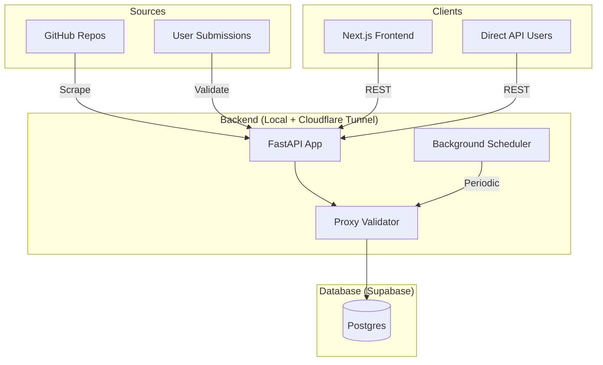

# 🤖 LLM Context & Command Reference (1proxy)

This document is optimized for LLMs to quickly understand the project structure, operational commands, and system invariants.

## 🌍 Environment Status
- **Repository**: `oyi77/1proxy`
- **Primary Branch**: `main`
- **Frontend URL**: `https://oyi77.is-a.dev/1proxy/`
- **Backend API URL**: `https://1proxy-api.aitradepulse.com`

## 🏗️ Technical Architecture



## 🛠️ Operational Commands (Backend)

| Action | Command | Purpose |
|--------|---------|---------|
| **Migrate** | `alembic upgrade head` | Sync DB schema to latest |
| **Start Dev** | `uvicorn app.main:app --reload` | Run API with hot-reload |
| **Scrape All** | `python -m app.grabber.github_grabber` | Manual trigger for all sources |
| **Test** | `pytest tests/` | Run full test suite |
| **Clean DB** | `rm data/1proxy.db && alembic upgrade head` | Reset database state (Dev only) |

## 📦 Deployment Commands

### Backend (Railway)
The backend is deployed from `railway.json` and `1proxy-backend/Dockerfile.railway`:
```bash
railway up
```
Production database access comes from Railway `DATABASE_URL`, pointing at Supabase Postgres with a `postgresql+asyncpg://...` URL.

### Frontend (GitHub Pages)
The frontend is auto-deployed via GitHub Actions on every push to `main`.
To build manually:
```bash
cd 1proxy-frontend
NEXT_PUBLIC_BASE_PATH='/1proxy' npm run build
```

## 🔐 Core Invariants (MUST FOLLOW)
1. **Async-Only**: All database and network I/O must be `async/await`. No blocking `requests` or `time.sleep`.
2. **Path Mapping**: When deploying to subdirectory, `NEXT_PUBLIC_BASE_PATH` must match the URL path.
3. **Validation**: No proxy is served to the public until `ProxyValidator.validate()` sets `is_active=True`.
4. **Secrets**: Never commit `.env`, Railway tokens, Supabase service-role JWTs, OAuth secrets, or database passwords. Use Railway Variables and GitHub Actions secrets.

## 📁 Critical Files
- `1proxy-backend/app/main.py`: App Entry & CORS
- `1proxy-backend/app/validator.py`: Quality Scoring Logic
- `1proxy-frontend/next.config.ts`: Export & Path Settings
- `1proxy-backend/Dockerfile.railway`: Production Build Recipe
- `railway.json`: Railway Service Config
- `docs/deployment.md`: GitHub Pages + Railway + Supabase runbook

---
*Assistant Hint: Always check `AGENTS.md` in each subdirectory for domain-specific deep context.*
