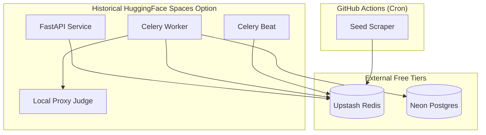
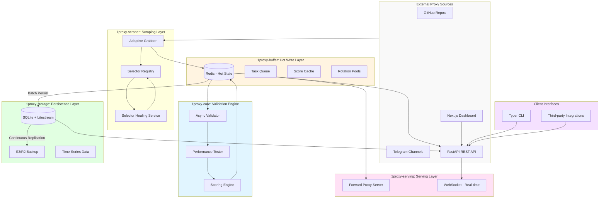
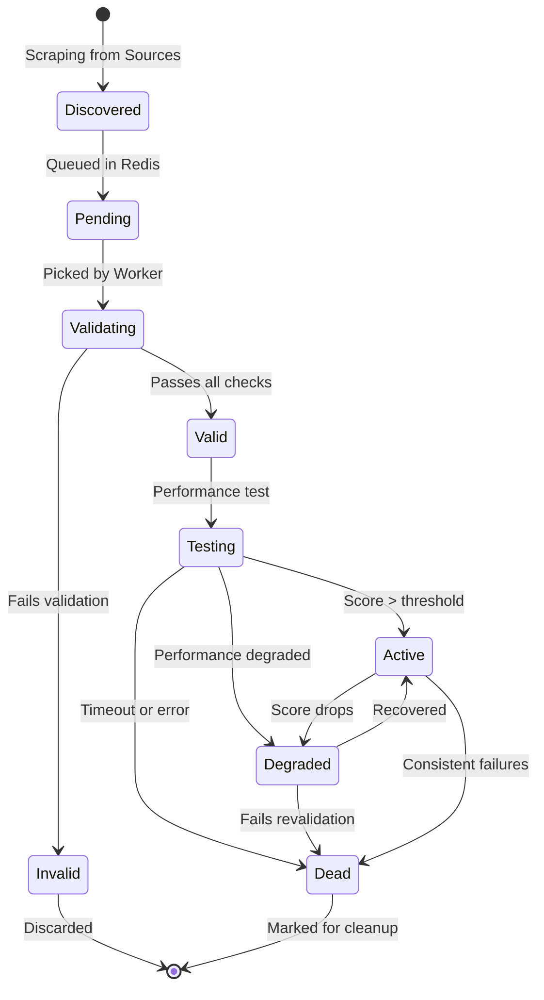

# SDD: 1proxy Platform (Robust, Free, Fast)

> **Status note (2026-04-28):** This SDD contains original architecture research and historical deployment options. The current production runbook is GitHub Pages frontend, Railway backend, and Supabase Postgres database. See [`deployment.md`](./deployment.md) and [`infrastructure.md`](./infrastructure.md) for live operations.

## 1. Introduction
1proxy is a high-performance proxy aggregation platform inspired by `wzdnzd/aggregator`. It aims to provide a robust, completely free (zero-infrastructure cost) solution for aggregating, validating, and serving proxies across multiple protocols (VMess, VLESS, Reality, Trojan, Shadowsocks, HTTP, SOCKS).

## 2. Architectural Design (Optimized for $0)

### 2.1 Core Strategy: "Ephemeral Hot, Persistent Cold"
Original research considered free tiers such as Railway, HuggingFace, and Neon; current production uses Railway plus Supabase Postgres. The historical hybrid strategy was:
- **Hot Buffer (Redis)**: ephemeral storage for high-frequency status updates and real-time rotation.
- **Persistent Store (Postgres)**: long-term metadata and metrics.
- **Free PaaS Selection**:
    - **API & Workers**: Historical HuggingFace Spaces option (Docker).
    - **Database**: Neon (Serverless Postgres) - 500MB free, high concurrency.
    - **Cache**: Upstash (Serverless Redis) - 10k requests/day free (Hot state).
    - **Scraping**: GitHub Actions (Cron) - Periodic "seed" scraping.

### 2.2 Component Diagram


## 3. Module Specifications

### 3.1 Adaptive Grabber (SDD)
- **Design Pattern**: Registry Pattern with Multi-tier Strategies.
- **Logic**:
    1. **Subscription Parsing**: Uses `v2ray2proxy` or custom logic to parse Base64 encoded URLs.
    2. **Resilience**: Tier 1 (Hardcoded selectors), Tier 2 (Semantic), Tier 3 (LLM-fallback).
    3. **Protocols**: Supports advanced Xray protocols (Reality, Hysteria2) by using `sing-box` as the validation engine.

### 3.2 Multi-Layer Validator (TDD)
- **TDD Requirement**: Red-Green-Refactor implementation for every leak check.
- **Layers**:
    - `connectivity`: HTTP 200 OK via proxy.
    - `anonymity`: Compare `remote_addr` vs `X-Forwarded-For`.
    - `leak_check`: DNS and WebRTC leaks.
    - `fingerprint`: JA3/TLS signature verification.

## 4. Free Deployment Blueprint

### 4.1 "Zero Sleep" Hack
For historical sleep-prone hosts, **UptimeRobot** or **Healthchecks.io** could send a heartbeat request every 5-15 minutes. The current Railway deployment instead relies on Railway service settings and the app's lightweight database keepalive worker.

### 4.2 Resource Constraints & Mitigation
| Resource | Limit (Free Tier) | 1proxy Mitigation Strategy |
|----------|-------------------|----------------------------|
| Memory | 16GB (HF) | Optimized async workers, avoid heavy global variables. |
| DB Storage | 500MB (Neon) | Auto-cleanup logs older than 7 days; archive metrics. |
| Redis Req | 10k/day (Upstash) | Batch updates from workers; use local memory for micro-caching. |
| CPU | 2 vCPU (HF) | Prioritize `asyncio` over `threading` for I/O bound tasks. |

## 5. Implementation Roadmap (TDD Cycle)

### Phase 1: Storage & Models (SDD)
- Define Pydantic models for `Proxy`, `ValidationResult`, `Source`.
- Setup SQLAlchemy/Alembic migrations for Neon.

### Phase 2: Grabber (TDD)
- **Red**: Write test for `GitHubGrabber` expecting specific raw URL output.
- **Green**: Implement regex-based extraction.
- **Refactor**: Abstract extraction logic into `BaseGrabber`.

### Phase 3: Serving (API)
- FastAPI endpoints for `/proxies/list`, `/proxies/rotate`.
- Implementation of "Sticky Sessions" using Redis TTL keys.

## 6. Financial Sustainability & Transparency
Since the goal is a **completely free** experience for the user:
- **Documentation**: All cost-saving hacks (like HF zero-sleep) must be documented in `docs/infrastructure.md`.
- **Donation**: A "Support Infrastructure" section in `README.md` will refer to the `docs/correlation.md` which explains why certain features might require paid tiers in the future (e.g., higher frequency re-validation).


## Executive Summary

1proxy is a comprehensive proxy aggregation platform inspired by **wzdnzd/aggregator** (5.5k+ GitHub stars) but evolved into a full-featured platform with frontend, backend, CLI, and robust infrastructure. The platform crawls, validates, tests, and serves free proxies with enterprise-grade reliability while maintaining **$0 infrastructure cost** through intelligent use of free tiers and SQLite+Litestream for production-grade persistence.

### Key Differentiators

1. **Full Platform Approach**: Not just a scraper - includes dashboard, CLI, API, and forward proxy server
2. **Zero-Cost Infrastructure**: SQLite+Litestream replaces expensive RDS, self-hosted Redis instead of managed services
3. **Multi-Layer Validation**: Headers, IP reputation, protocol leaks (DNS/WebRTC), TLS fingerprinting
4. **Adaptive Grabber**: Tiered selector strategy with exact, semantic, and LLM-fallback approaches
5. **TDD Foundation**: Test-driven development with Red-Green-Refactor for critical modules

---

## 1. System Overview

### 1.1 Architecture Diagram



### 1.2 Design Principles

| Principle | Description |
|-----------|-------------|
| **Zero Cost First** | Every infrastructure decision evaluated against free tier constraints |
| **Async Everywhere** | Non-blocking I/O for scraping, validation, testing |
| **Defensive Scraping** | Multi-tier selectors with automatic healing |
| **Progressive Enhancement** | MVP on SQLite, easy migration path to Postgres if needed |
| **Observability** | Metrics at every stage for debugging and optimization |
| **TDD-Driven** | Test-first development for Validator and Grabber modules |

### 1.3 Technology Stack

| Component | Technology | Rationale |
|-----------|-------------|-----------|
| **Backend API** | FastAPI (Python 3.12+) | Modern async web framework, auto-generated docs, type hints |
| **Frontend** | Next.js 14 + React | Server components, app router, excellent DX |
| **CLI** | Typer + Rich | Modern CLI library, beautiful terminal output |
| **Persistence** | SQLite + Litestream | Single-node simplicity with production-grade backups |
| **Buffer/Cache** | Redis (self-hosted or Upstash free) | Hot data, task queues, rotation pools |
| **Async Workers** | FastAPI BackgroundTasks + Celery-lite | Lighter than full Celery, integrates well |
| **Scraping** | Playwright + aiohttp | JS-heavy pages (Playwright), high-speed fetch (aiohttp) |
| **Testing** | pytest + pytest-asyncio | Industry standard, async support |
| **Containerization** | Docker + Docker Compose | Development and deployment consistency |
| **Deployment** | Fly.io / Render / Railway (free tiers) | Global edge, zero-downtime deploys |

---

## 2. Data Flow Architecture

### 2.1 Proxy Lifecycle



### 2.2 Data Flow Details

| Stage | Storage Format | Retention | Purpose |
|--------|----------------|------------|---------|
| **Raw Scraped** | Redis List (LPUSH) | 5 min | Immediate queue for validation |
| **Validating** | Redis HSET | 1 hour | In-flight validation state |
| **Active Pool** | Redis Sorted Set (ZSET) | Persistent | Score-based rotation |
| **Proxy Metadata** | SQLite Table | Permanent | IP, port, protocol, source, first_seen |
| **Validation History** | SQLite Table + Time Partition | 30 days | Audit trail, analytics |
| **Performance Metrics** | SQLite Table | 90 days | Latency, success_rate, throughput |

---

## 3. Core Modules

### 3.1 Grabber Module (Scraper)

**Responsibility**: Extract proxy addresses from diverse sources resiliently.

#### 3.1.1 Adaptive Selector Strategy

```python
class AdaptiveGrabber:
    """
    Tiered selector approach with automatic healing.
    Priorities: Exact Selectors → Semantic Patterns → LLM Fallback
    """
    
    async def extract_proxies(self, source: SourceConfig) -> List[Proxy]:
        # 1. Try exact CSS/XPath selectors (cached)
        proxies = await self._try_exact_selectors(source)
        if proxies:
            return proxies
            
        # 2. Fallback to semantic patterns
        proxies = await self._try_semantic_patterns(source)
        if proxies:
            # Cache successful pattern
            self.selector_registry.cache_success(source.url, pattern)
            return proxies
            
        # 3. LLM-based healing (async, low-priority)
        self.healing_queue.enqueue(source)
        
        return []
```

#### 3.1.2 Source Types

| Source Type | Protocol | Complexity | Example |
|-------------|-----------|-------------|----------|
| **GitHub Raw Files** | HTTP | Low | `github.com/user/proxy-list/raw/main/list.txt` |
| **GitHub Gists** | HTTP | Low | Gist with embedded proxy list |
| **Public Web Lists** | HTTP/HTTPS | Medium | `spys.me`, `free-proxy-list.net` |
| **Telegram Channels** | MTProto | High | Requires Telethon |
| **Scrape APIs** | REST API | Low | JSON endpoints |

#### 3.1.3 TDD Red-Green-Refactor: Grabber

**RED Phase** (Write failing test):
```python
# tests/test_grabber.py
import pytest
from app.grabber import AdaptiveGrabber

@pytest.mark.asyncio
async def test_extract_from_github_raw():
    grabber = AdaptiveGrabber()
    source = SourceConfig(
        type="github_raw",
        url="https://github.com/example/proxies/raw/main/list.txt"
    )
    
    # This should fail initially
    proxies = await grabber.extract_proxies(source)
    
    assert len(proxies) > 0
    assert all(p.port in [80, 8080, 3128] for p in proxies)
```

**GREEN Phase** (Write minimal implementation):
```python
# app/grabber.py
class AdaptiveGrabber:
    async def extract_proxies(self, source: SourceConfig) -> List[Proxy]:
        if source.type == "github_raw":
            return await self._fetch_and_parse_text(source.url)
        return []
```

**REFACTOR Phase** (Improve without breaking):
- Add selector caching
- Implement retry logic
- Add rate limiting

---

### 3.2 Validator Module

**Responsibility**: Multi-layer validation to ensure proxy anonymity and functionality.

#### 3.2.1 Validation Layers

```python
class ProxyValidator:
    """
    Layered validation pipeline with configurable depth.
    """
    
    async def validate(self, proxy: Proxy, depth: int = 4) -> ValidationResult:
        results = []
        
        # Layer 1: Basic connectivity & headers
        results.append(await self._check_basic(proxy))
        if not results[-1].passed or depth < 2:
            return self._aggregate(results)
            
        # Layer 2: IP reputation
        results.append(await self._check_reputation(proxy.ip))
        if not results[-1].passed or depth < 3:
            return self._aggregate(results)
            
        # Layer 3: Protocol leaks (DNS/WebRTC)
        results.append(await self._check_leaks(proxy))
        if not results[-1].passed or depth < 4:
            return self._aggregate(results)
            
        # Layer 4: TLS fingerprinting
        results.append(await self._check_tls_fingerprint(proxy))
        
        return self._aggregate(results)
```

#### 3.2.2 Layer Specifications

| Layer | Check | Pass Criteria | Duration |
|-------|--------|---------------|----------|
| **1. Basic** | Connect, get headers, check `Via`, `X-Forwarded-For` | No proxy headers revealed | < 3s |
| **2. Reputation** | AbuseIPDB check | Clean reputation | < 2s |
| **3. Leaks** | DNS leak, WebRTC leak (via Playwright) | No leaks detected | < 8s |
| **4. TLS** | JA3 fingerprint matching | Matches browser fingerprint | < 5s |

#### 3.2.3 TDD Red-Green-Refactor: Validator

**RED Phase**:
```python
# tests/test_validator.py
import pytest
from app.validator import ProxyValidator

@pytest.mark.asyncio
async def test_basic_validation_elite():
    validator = ProxyValidator()
    proxy = Proxy(ip="1.2.3.4", port=8080, type="http")
    
    result = await validator.validate(proxy, depth=1)
    
    assert result.is_elite
    assert result.layers[0].passed  # Basic layer
    assert "Via" not in result.headers
    assert "X-Forwarded-For" not in result.headers
```

**GREEN Phase**:
```python
# app/validator.py
class ProxyValidator:
    async def _check_basic(self, proxy: Proxy) -> LayerResult:
        try:
            async with aiohttp.ClientSession() as session:
                async with session.get(
                    "https://httpbin.org/headers",
                    proxy=f"http://{proxy.ip}:{proxy.port}",
                    timeout=3
                ) as resp:
                    headers = await resp.json()
                    
                    if "Via" in headers or "X-Forwarded-For" in headers:
                        return LayerResult(passed=False, headers=headers)
                    
                    return LayerResult(passed=True, headers=headers)
        except:
            return LayerResult(passed=False, headers={})
```

**REFACTOR Phase**:
- Add async semaphore for concurrent validation
- Implement adaptive timeout based on proxy type
- Cache IP reputation results (TTL 24h)

---

### 3.3 Tester Module (Performance)

**Responsibility**: Measure and score proxy performance for intelligent rotation.

#### 3.3.1 Scoring Algorithm

```python
class PerformanceTester:
    """
    Multi-metric scoring with adaptive thresholds.
    """
    
    async def score(self, proxy: Proxy) -> ProxyScore:
        metrics = await self._measure_metrics(proxy)
        
        # Normalized scores (0-100)
        latency_score = self._score_latency(metrics.latency)  # Lower is better
        success_score = self._score_success_rate(metrics.success_rate)
        stability_score = self._score_stability(metrics.uptime_history)
        
        # Weighted average
        total_score = (
            0.4 * latency_score +
            0.4 * success_score +
            0.2 * stability_score
        )
        
        return ProxyScore(
            total=total_score,
            latency_score=latency_score,
            success_score=success_score,
            metrics=metrics
        )
    
    def _score_latency(self, latency_ms: float) -> float:
        """0-100 score based on latency buckets."""
        if latency_ms < 200: return 100
        if latency_ms < 500: return 80
        if latency_ms < 1000: return 50
        if latency_ms < 2000: return 20
        return 0
```

#### 3.3.2 Adaptive Re-validation (Scylla Pattern)

```python
class AdaptiveScheduler:
    """
    Dynamically adjust validation frequency based on proxy volatility.
    """
    
    async def schedule_revalidation(self, proxy: Proxy, score: ProxyScore):
        # High-scoring proxies: validate every 15 min
        if score.total > 80:
            interval = 900  # 15 min
        # Medium: every 5 min
        elif score.total > 50:
            interval = 300  # 5 min
        # Low/volatile: every 1-2 min
        else:
            interval = 120  # 2 min
            
        await self.queue.enqueue(proxy, interval)
```

---

### 3.4 Rotator Module

**Responsibility**: Intelligent proxy selection with sticky sessions.

#### 3.4.1 Score-Weighted Selection

```python
class ProxyRotator:
    """
    Weighted random selection biased toward high-scoring proxies.
    """
    
    async def select_proxy(
        self, 
        filters: ProxyFilters,
        session_id: str = None
    ) -> Proxy:
        # If sticky session requested, try to reuse
        if session_id:
            cached = await self.redis.get(f"session:{session_id}")
            if cached:
                proxy = Proxy.parse(cached)
                if await self._is_healthy(proxy):
                    return proxy
        
        # Get top 100 proxies by score
        pool = await self.redis.zrevrangebyscore(
            "active_proxies", 
            min=0, max=100,
            start=0, num=100, withscores=True
        )
        
        # Apply filters (geography, protocol, etc.)
        filtered = self._apply_filters(pool, filters)
        
        # Weighted selection (higher score = higher probability)
        selected = self._weighted_select(filtered)
        
        # Cache for sticky session
        if session_id:
            await self.redis.setex(
                f"session:{session_id}", 
                3600,  # 1 hour TTL
                selected.to_json()
            )
        
        return selected
```

#### 3.4.2 Forward Proxy Server

```python
from fastapi import FastAPI, Request
import httpx

forward_app = FastAPI()

@forward_app.api_route("/{path:path}", methods=["GET", "POST"])
async def forward_request(request: Request, path: str):
    """Transparent forward proxy endpoint."""
    
    # Select best proxy
    proxy = await rotator.select_proxy(request.headers)
    
    # Forward request
    async with httpx.AsyncClient() as client:
        response = await client.request(
            method=request.method,
            url=f"http://target.com/{path}",
            headers=request.headers,
            proxy=f"http://{proxy.ip}:{proxy.port}"
        )
    
    return Response(
        content=response.content,
        status_code=response.status_code,
        headers=response.headers
    )
```

---

## 4. Storage Architecture

### 4.1 SQLite + Litestream Strategy

**Rationale**: Single-node simplicity with production-grade disaster recovery at zero infrastructure cost.

#### 4.1.1 Schema Design

```sql
-- Proxies table (persistent metadata)
CREATE TABLE proxies (
    id INTEGER PRIMARY KEY AUTOINCREMENT,
    ip TEXT NOT NULL,
    port INTEGER NOT NULL,
    protocol TEXT NOT NULL,  -- http, https, socks4, socks5
    anonymity TEXT,  -- transparent, anonymous, elite
    country_code TEXT,
    source TEXT NOT NULL,
    first_seen TIMESTAMP DEFAULT CURRENT_TIMESTAMP,
    last_seen TIMESTAMP,
    UNIQUE(ip, port, protocol)
);

-- Validation history (time-partitioned)
CREATE TABLE validation_history (
    id INTEGER PRIMARY KEY AUTOINCREMENT,
    proxy_id INTEGER NOT NULL,
    validated_at TIMESTAMP DEFAULT CURRENT_TIMESTAMP,
    layers_passed INTEGER,
    layers_total INTEGER,
    is_elite BOOLEAN,
    FOREIGN KEY (proxy_id) REFERENCES proxies(id) ON DELETE CASCADE
);

CREATE INDEX idx_validation_history_proxy_id ON validation_history(proxy_id);
CREATE INDEX idx_validation_history_validated_at ON validation_history(validated_at);

-- Performance metrics
CREATE TABLE performance_metrics (
    id INTEGER PRIMARY KEY AUTOINCREMENT,
    proxy_id INTEGER NOT NULL,
    measured_at TIMESTAMP DEFAULT CURRENT_TIMESTAMP,
    latency_ms REAL,
    success_rate REAL,
    throughput_kbs REAL,
    FOREIGN KEY (proxy_id) REFERENCES proxies(id) ON DELETE CASCADE
);
```

#### 4.1.2 Litestream Configuration

```yaml
# litestream.yml
dbs:
  - path: /data/proxies.db
    replicas:
      # Cloudflare R2 (free, compatible with S3 API)
      - url: s3://1proxy-backups/proxies.db
        endpoint: https://<account-id>.r2.cloudflarestorage.com
        access-key-id: ${R2_ACCESS_KEY}
        secret-access-key: ${R2_SECRET_KEY}
        retention: 720h  # 30 days
        snapshot-interval: 24h
        sync-interval: 1s  # Continuous replication
```

#### 4.1.3 Docker Compose Setup

```yaml
version: '3.8'

services:
  api:
    build: ./1proxy-backend
    ports:
      - "8000:8000"
    volumes:
      - ./data:/data
    environment:
      - DATABASE_URL=sqlite:////data/proxies.db
      - REDIS_URL=redis://redis:6379
      - LITESTREAM_ENABLED=true
    depends_on:
      - redis

  redis:
    image: redis:7-alpine
    ports:
      - "6379:6379"
    volumes:
      - redis_data:/data
    command: redis-server --appendonly yes

  litestream:
    image: litestream/litestream:latest
    volumes:
      - ./data:/data
      - ./litestream.yml:/etc/litestream.yml
    environment:
      - R2_ACCESS_KEY=${R2_ACCESS_KEY}
      - R2_SECRET_KEY=${R2_SECRET_KEY}
    command: replicate

  worker:
    build: ./1proxy-backend
    command: celery -A app.worker worker --loglevel=info
    environment:
      - DATABASE_URL=sqlite:////data/proxies.db
      - REDIS_URL=redis://redis:6379
    depends_on:
      - redis
      - api

volumes:
  redis_data:
```

### 4.2 Redis Data Structures

| Key Pattern | Type | TTL | Purpose |
|-------------|------|-----|---------|
| `proxies:pending` | List | 5 min | Queue for validation |
| `proxies:active` | ZSET | Permanent | Score-sorted active pool |
| `proxy:{id}:meta` | HASH | 1 hour | In-flight validation data |
| `proxy:{id}:score` | STRING | 15 min | Cached score (adaptive) |
| `session:{id}` | STRING | 1 hour | Sticky session mapping |
| `source:{url}:selector` | STRING | 24 hours | Cached selectors |

### 4.3 Migration Path to PostgreSQL

**When to migrate**:
- Single database file exceeds 10 GB
- Need distributed read replicas
- Require complex analytical queries (JOIN-heavy)

**Migration strategy**:
1. Add PostgreSQL connection option to ORM
2. Run dual-write during transition
3. Backfill SQLite data to Postgres
4. Switch reads to Postgres
5. Retire SQLite+Litestream (keep for backups)

---

## 5. Infrastructure ($0 Cost Strategy)

### 5.1 Deployment Options

| Platform | Free Tier | Services | Limitations |
|----------|------------|-----------|--------------|
| **Fly.io** | 3 VMs, 256MB RAM each | App, Redis, Workers | Sleeps after inactivity |
| **Render** | 1 web service, 1 database | App, Postgres | No free Redis, requires paid plan |
| **Railway** | $5 credit/month, renews monthly | App, Redis, Postgres | $5/month after credit |
| **Koyeb** | 50 active hours/month | App, Postgres | Auto-sleeps after 5 min |
| **Vercel** | Edge functions only | Frontend | Not suitable for backend |

**Recommended**: **Fly.io** for global edge deployment + self-hosted Redis + SQLite+Litestream.

### 5.2 Cost Breakdown ($0 Strategy)

| Component | Traditional Cost | $0 Strategy | Monthly Savings |
|-----------|------------------|---------------|-----------------|
| **Database** | RDS Postgres (~$15/mo) | SQLite + Litestream + Cloudflare R2 | **$15** |
| **Redis** | Elasticache (~$25/mo) | Self-hosted on Fly.io VM or Upstash free tier | **$25** |
| **Storage** | S3 Standard (~$23/mo) | Cloudflare R2 ($0/10GB, $0.015/GB out) | **$23** |
| **Workers** | ECS Fargate (~$30/mo) | Fly.io VMs (3 free) | **$30** |
| **CDN** | CloudFront (~$20/mo) | Cloudflare Free Tier | **$20** |
| **TOTAL** | **~$113/mo** | **$0 + minimal egress** | **~$113** |

### 5.3 Monitoring & Observability

**Free tier tools**:
- **Grafana Cloud** (50k metrics, 50 logs/s free)
- **Sentry** (5k errors/month free)
- **Uptime.com** (5 monitors free)

**Self-hosted options**:
- **Prometheus** (via Docker Compose)
- **Loki** (log aggregation)
- **Grafana** (visualization dashboard)

---

## 6. API Design

### 6.1 REST Endpoints

```yaml
# Proxy Retrieval
GET /api/v1/proxies
  Query Parameters:
    - protocol: http|https|socks4|socks5
    - country: US, DE, GB...
    - anonymity: elite|anonymous|transparent
    - limit: number (default: 10, max: 1000)
  Response: List[Proxy]
  
GET /api/v1/proxies/:id
  Response: Proxy (with metrics)

# Proxy Testing
POST /api/v1/proxies/test
  Body: { "proxies": [ProxyInput] }
  Response: { "results": [TestResult] }

# Statistics
GET /api/v1/stats
  Response: StatsOverview
    - total_proxies: int
    - active_proxies: int
    - by_country: Map[Country, Count]
    - avg_latency: float

# Forward Proxy
GET /api/v1/forward/:session_id?
  Response: Stream (proxied response)

# Real-time (WebSocket)
WS /api/v1/ws/stats
  Events: stats_update, proxy_discovered, proxy_died
```

### 6.2 WebSocket Real-time Updates

```python
# WebSocket event types
class StatsUpdate(BaseModel):
    type: Literal["stats_update"]
    timestamp: datetime
    data: {
        "total_proxies": int,
        "active_proxies": int,
        "countries_added": List[str]
    }

class ProxyDiscovered(BaseModel):
    type: Literal["proxy_discovered"]
    timestamp: datetime
    proxy: Proxy
    source: str
```

---

## 7. Frontend Architecture (Next.js 14)

### 7.1 Page Structure

```
/                          # Dashboard with live stats
├── /proxies               # Proxy browser with filters
│   ├── /country/:code      # Country-specific view
│   └── /status/:type      # Filter by status
├── /sources               # Source management
├── /analytics             # Historical metrics
├── /settings             # Configuration
└── /api                 # API documentation (auto-gen)
```

### 7.2 Component Architecture

```typescript
// app/proxies/page.tsx
export default function ProxiesPage() {
  return (
    <DashboardLayout>
      <ProxyFilters />
      <ProxyTable />
      <ProxyMap />
      <RealtimeStats />
    </DashboardLayout>
  );
}

// Components for real-time updates
function RealtimeStats() {
  const { data, error } = useWebSocket('/api/v1/ws/stats');
  
  if (data?.type === 'stats_update') {
    return <StatsCard {...data.data} />;
  }
}
```

### 7.3 State Management

**Approach**: React Query (TanStack Query) for server state, Zustand for client state.

```typescript
// hooks/useProxies.ts
export function useProxies(filters: ProxyFilters) {
  return useQuery({
    queryKey: ['proxies', filters],
    queryFn: () => fetchProxies(filters),
    refetchInterval: 30000, // 30 seconds
    staleTime: 10000
  });
}
```

---

## 8. CLI Design (Typer + Rich)

### 8.1 Command Structure

```bash
$ 1proxy --help
Usage: 1proxy [OPTIONS] COMMAND [ARGS]...

  One-stop proxy aggregation platform.

Options:
  --config PATH    Path to config file [default: ~/.config/1proxy/config.yml]
  --verbose        Enable verbose logging
  --help           Show this message and exit.

Commands:
  scrape           Scrape proxies from configured sources
  validate         Validate proxy list (file or API)
  test             Test proxy performance
  serve            Start local forward proxy server
  export           Export proxies to file (JSON, TXT, CSV)
  stats            Show platform statistics
  config           Manage configuration
```

### 8.2 Rich Output Examples

```python
import typer
from rich.console import Console
from rich.table import Table
from rich.panel import Panel

app = typer.Typer()
console = Console()

@app.command()
def stats():
    """Show platform statistics."""
    # Get data
    stats = get_stats()
    
    # Create table
    table = Table(title="Proxy Statistics")
    table.add_column("Metric", style="cyan")
    table.add_column("Value", style="green")
    table.add_row("Total Proxies", str(stats.total))
    table.add_row("Active", str(stats.active))
    table.add_row("Elite", str(stats.elite))
    
    console.print(table)
    
    # Panel with countries
    countries = ", ".join(f"[bold]{k}[/bold]: {v}" for k, v in stats.by_country.items())
    console.print(Panel(countries, title="Top Countries"))
```

**Output**:
```
┏━━━━━━━━━━━━━━━━━━━━┳━━━━━━━━━┓
┃ Proxy Statistics  ┃          ┃
┡━━━━━━━━━━━━━━━━━━━━╇━━━━━━━━━┩
│ Total Proxies      │ 12,456   │
│ Active            │ 8,234     │
│ Elite             │ 4,102     │
└───────────────────┴───────────┘

╭─────────────────────────────────╮
│ Top Countries                │
│ US: 3,421  DE: 2,156  │
│ GB: 1,892  FR: 1,543  │
╰─────────────────────────────────╯
```

---

## 9. TDD Implementation Guide

### 9.1 Test Directory Structure

```
1proxy-backend/
├── tests/
│   ├── __init__.py
│   ├── conftest.py              # Pytest fixtures
│   ├── unit/
│   │   ├── test_grabber.py
│   │   ├── test_validator.py
│   │   └── test_rotator.py
│   ├── integration/
│   │   ├── test_api.py
│   │   └── test_worker.py
│   └── e2e/
│       └── test_full_flow.py
```

### 9.2 Pytest Configuration

```python
# pytest.ini
[pytest]
testpaths = tests
python_files = test_*.py
python_classes = Test*
python_functions = test_*
addopts =
    --strict-markers
    --asyncio-mode=auto
    --cov=app
    --cov-report=html
    --cov-report=term-missing

markers =
    slow: marks tests as slow (deselect with '-m "not slow"')
    integration: marks tests as integration tests
    e2e: marks tests as end-to-end tests
```

### 9.3 Fixtures (conftest.py)

```python
import pytest
import asyncio
from httpx import AsyncClient

@pytest.fixture
async def client():
    """FastAPI test client."""
    from app.main import app
    async with AsyncClient(app=app, base_url="http://test") as ac:
        yield ac

@pytest.fixture
async def redis():
    """Redis test connection."""
    import redis.asyncio as aioredis
    client = await aioredis.from_url("redis://localhost:6379", db=15)
    yield client
    await client.flushdb()
    await client.close()

@pytest.fixture
async def mock_proxy():
    """Standard mock proxy for testing."""
    from app.models import Proxy
    return Proxy(
        ip="127.0.0.1",
        port=8080,
        protocol="http",
        source="test"
    )
```

---

## 10. Security Considerations

### 10.1 Threat Model

| Threat | Mitigation |
|---------|------------|
| **SQL Injection** | Parameterized queries via ORM |
| **Rate Limiting Abuse** | Redis-based rate limiter per IP |
| **Proxy Injection** | Validate IP:port format, strict typing |
| **DoS on API** | Async request limits, circuit breakers |
| **Data Exfiltration** | Row-level security, no PII stored |
| **Credential Theft** | Environment variables, no hardcoded secrets |

### 10.2 Rate Limiting

```python
from fastapi import Request, HTTPException
from slowapi import Limiter

limiter = Limiter(key_func=get_remote_address)

@api.get("/api/v1/proxies")
@limiter.limit("100/minute")
async def get_proxies(request: Request):
    """Rate-limited proxy retrieval."""
    pass
```

---

## 11. Deployment Guide

The live production deployment is documented in [`deployment.md`](./deployment.md). The examples below are retained as historical alternatives and design references.

### 11.1 Historical Fly.io Deployment Option

```bash
# Install flyctl
curl -L https://fly.io/install.sh | sh

# Login
flyctl auth login

# Initialize
cd 1proxy-backend
flyctl launch

# Create secrets
flyctl secrets set R2_ACCESS_KEY=xxx R2_SECRET_KEY=yyy

# Deploy
flyctl deploy

# Scale regions
flyctl scale count 3 --region iad
flyctl scale count 2 --region fra
```

### 11.2 Health Checks

```python
from fastapi import FastAPI

app = FastAPI()

@app.get("/health")
async def health_check():
    """Kubernetes-style health check."""
    checks = {
        "api": "healthy",
        "redis": await check_redis(),
        "database": await check_sqlite(),
        "litestream": await check_litestream()
    }
    
    status = 200 if all(v == "healthy" for v in checks.values()) else 503
    return JSONResponse(content=checks, status_code=status)
```

---

## 12. Future Enhancements

| Feature | Priority | Effort | Description |
|----------|-----------|----------|-------------|
| **IP Reputation Feed** | Medium | Short (2-3d) | AbuseIPDB integration for real-time reputation |
| **GeoIP Database** | Medium | Short (1-2d) | MaxMind GeoLite2 for country detection |
| **Proxy Marketplace** | Low | Large (2w+) | User-contributed proxy lists with credits |
| **Mobile App** | Low | Large (3w+) | React Native app for mobile access |
| **Machine Learning Scoring** | Medium | Large (2w+) | Anomaly detection for proxy behavior |
| **Multi-Cloud Backup** | Low | Medium (3-5d) | Additional backup to Backblaze B2 |

---

## Appendix A: Configuration Reference

```yaml
# config.yml
sources:
  github:
    - url: https://github.com/user/proxies/raw/main/list.txt
      enabled: true
      interval: 3600  # Every hour
  
  telegram:
    - channel: "@proxylist"
      enabled: false
  
validation:
  depth: 4  # Number of validation layers
  timeout: 10  # Seconds
  concurrent: 100  # Parallel validations

scoring:
  min_threshold: 50  # Minimum score to be "active"
  weights:
    latency: 0.4
    success: 0.4
    stability: 0.2

storage:
  database_url: sqlite:////data/proxies.db
  redis_url: redis://localhost:6379
  litestream:
    enabled: true
    backup_url: s3://1proxy-backups/proxies.db

api:
  host: 0.0.0.0
  port: 8000
  cors_origins: ["*"]
  rate_limit: "100/minute"
```

---

## Appendix B: API Response Examples

```json
{
  "proxies": [
    {
      "id": 12345,
      "ip": "192.168.1.1",
      "port": 8080,
      "protocol": "http",
      "anonymity": "elite",
      "country_code": "US",
      "score": 85.5,
      "latency_ms": 234,
      "success_rate": 0.95,
      "last_validated": "2026-01-11T14:30:00Z"
    }
  ],
  "meta": {
    "total": 8234,
    "page": 1,
    "limit": 10
  }
}
```

---

## Document Revision History

| Version | Date | Author | Changes |
|---------|-------|---------|----------|
| 1.0.0 | 2026-01-11 | Initial SDD - comprehensive architecture design |

---

## Approval

| Role | Name | Signature | Date |
|-------|------|-----------|-------|
| **Tech Lead** | TBD | TBD | TBD |
| **Product Owner** | TBD | TBD | TBD |
| **Security Review** | TBD | TBD | TBD |
