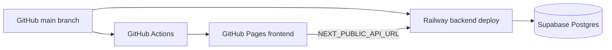

# Deployment Guide

Current production topology:

- **Frontend:** GitHub Pages static export at `https://oyi77.is-a.dev/1proxy/`.
- **Backend:** Railway FastAPI service at `https://helpful-alignment-production-2ae5.up.railway.app`.
- **Database:** Supabase Postgres, consumed by the backend through `DATABASE_URL`.

Do not commit real tokens, OAuth secrets, Supabase service-role keys, or Railway tokens. Store them only in provider secret managers.

## Architecture



## Frontend: GitHub Pages

The frontend is deployed by `.github/workflows/deploy-frontend.yml`.

Required build-time environment:

| Variable | Value |
|----------|-------|
| `NEXT_PUBLIC_BASE_PATH` | `/1proxy` |
| `NEXT_PUBLIC_API_URL` | Railway backend URL |

Manual verification build:

```bash
cd 1proxy-frontend
NEXT_PUBLIC_BASE_PATH=/1proxy \
NEXT_PUBLIC_API_URL=https://helpful-alignment-production-2ae5.up.railway.app \
npm run build:clean
```

## Backend: Railway

Railway builds from `railway.json`, which uses `1proxy-backend/Dockerfile.railway` and runs Alembic migrations before starting Uvicorn.

Set these Railway variables:

| Variable | Purpose | Example |
|----------|---------|---------|
| `DATABASE_URL` | Supabase Postgres async connection | `postgresql+asyncpg://postgres.<project-ref>:<password>@aws-0-<region>.pooler.supabase.com:6543/postgres` |
| `SECRET_KEY` | JWT signing key | output of `openssl rand -hex 32` |
| `API_URL` | Public Railway backend URL | `https://helpful-alignment-production-2ae5.up.railway.app` |
| `FRONTEND_URL` | Public frontend origin/path | `https://oyi77.is-a.dev/1proxy` |
| `FRONTEND_BASE_PATH` | Frontend subpath for redirects | `/1proxy` |
| `GITHUB_CLIENT_ID` | GitHub OAuth app client ID | provider value |
| `GITHUB_CLIENT_SECRET` | GitHub OAuth app client secret | provider secret |
| `GOOGLE_CLIENT_ID` | Google OAuth client ID | provider value |
| `GOOGLE_CLIENT_SECRET` | Google OAuth client secret | provider secret |
| `GITHUB_REPO_OWNER` | Admin access repository owner | `oyi77` |
| `GITHUB_REPO_NAME` | Admin access repository name | `1proxy` |

Optional:

| Variable | Purpose |
|----------|---------|
| `REDIS_URL` | Redis URL if a Railway Redis service is attached |

Railway may provide `RAILWAY_PUBLIC_DOMAIN`; the app can derive `API_URL` from it, but setting `API_URL` explicitly is clearer for OAuth callbacks.

## Database: Supabase Postgres

Use the Supabase **connection string**, not the Supabase anon JWT or service-role JWT, for SQLAlchemy/Alembic.

Recommended production pattern:

1. In Supabase, copy a Postgres connection string for the project.
2. Convert it to SQLAlchemy async format if needed:
   - `postgres://...` -> `postgresql+asyncpg://...`
   - `postgresql://...` -> `postgresql+asyncpg://...`
3. Store it as Railway `DATABASE_URL`.
4. Let Railway deploy run `alembic upgrade head` through the Docker command.

Keep Supabase service-role JWTs out of the frontend and out of the repository. The current app does not need Supabase REST keys; it uses Postgres via SQLAlchemy.

## OAuth Callback URLs

Configure provider callbacks to the Railway backend:

| Provider | Callback URL |
|----------|--------------|
| GitHub | `https://helpful-alignment-production-2ae5.up.railway.app/auth/github/callback` |
| Google | `https://helpful-alignment-production-2ae5.up.railway.app/auth/google/callback` |

After successful login, backend redirects to `FRONTEND_URL` plus `FRONTEND_BASE_PATH`-aware routes.

## Local Development

```bash
cp .env.example .env
cp 1proxy-backend/.env.example 1proxy-backend/.env

cd 1proxy-backend
pip install -r requirements.txt
alembic upgrade head
uvicorn app.main:app --reload
```

```bash
cd 1proxy-frontend
npm install
npm run dev
```

## Secret Rotation Checklist

Rotate credentials immediately if they are posted in chat, logs, screenshots, issues, or commits:

1. Railway account/project token.
2. Supabase service-role JWT and database password.
3. GitHub OAuth client secret.
4. Google OAuth client secret.
5. Backend `SECRET_KEY` if exposed.

Then update Railway variables and redeploy.
