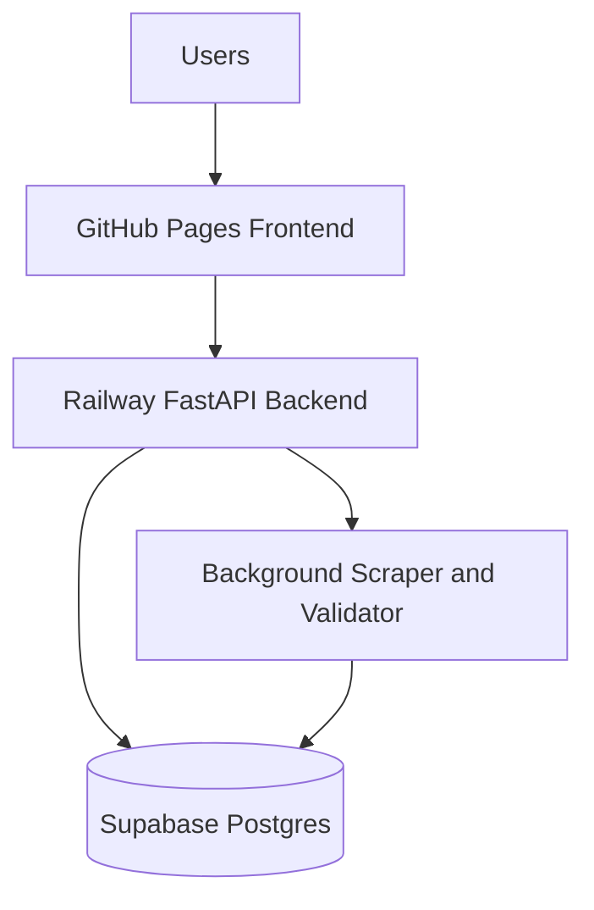

# Infrastructure Guide

This document describes the current 1proxy infrastructure and the local development equivalent.

## Current Production Stack

| Component | Provider | Notes |
|-----------|----------|-------|
| Frontend | GitHub Pages | Static Next.js export under `/1proxy` |
| Backend | Railway | FastAPI app, background scraper/validator workers, health check at `/health` |
| Database | Supabase Postgres | SQLAlchemy async connection through Railway `DATABASE_URL` |
| Cache | Redis-compatible URL, optional | Used when `REDIS_URL` is configured |



## Local Development

Backend:

```bash
cd 1proxy-backend
python -m venv .venv
source .venv/bin/activate
pip install -r requirements.txt
cp .env.example .env
alembic upgrade head
uvicorn app.main:app --reload
```

Frontend:

```bash
cd 1proxy-frontend
npm install
npm run dev
```

Docker Compose remains useful for local smoke testing with Redis:

```bash
docker-compose up
```

## Environment Variables

Backend variables are documented in [`../.env.example`](../.env.example), [`../1proxy-backend/.env.example`](../1proxy-backend/.env.example), and [`deployment.md`](./deployment.md).

Key production variables:

- `DATABASE_URL`: Supabase Postgres URL in SQLAlchemy async format.
- `SECRET_KEY`: Random JWT signing key.
- `API_URL`: Railway backend public URL.
- `FRONTEND_URL`: GitHub Pages/custom frontend URL.
- `FRONTEND_BASE_PATH`: `/1proxy` for the current GitHub Pages deployment.
- OAuth provider credentials: stored only in Railway variables.

## Operations

- Backend health: `GET /health`.
- API docs: `/docs` on the Railway backend.
- Metrics: `/metrics` on the backend.
- Migrations: Railway container runs `alembic upgrade head` before Uvicorn.

## Security Rules

1. Never commit `.env` files or provider credentials.
2. Never expose Supabase service-role JWTs to the frontend.
3. Use Supabase database connection strings only in Railway `DATABASE_URL`.
4. Rotate any token pasted into chat, logs, issues, screenshots, or commits.
5. Keep OAuth callback URLs pointed at the Railway backend.

See [`deployment.md`](./deployment.md) for the detailed deployment and rotation checklist.
